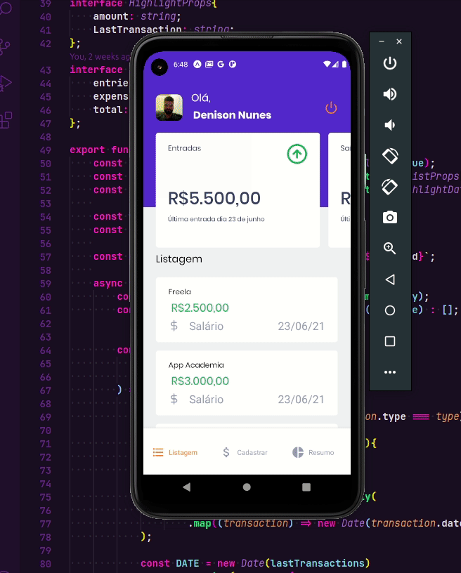

# Go Finances

It's a cross-platform mobile application biult with react-native.

## About

<b>Go Finances</b> it's a cross-platform mobile app built with react-native to provide the user with a practical way to control spending.

    Below, a gif that shows the app working:

## Installation

First you need to download this repository (or make a clone).
After that, you should <b>install</b> the <b>necessary dependencies</b> with a single command:

> yarn install

or

> npm install

## Running Application

To run this application, open two windows of your terminal on the project root and execute:

In the first window

> yarn server

In the second window

> expo start

The first command will turn on the json-server which simulates an api, the second will run the application itself.
